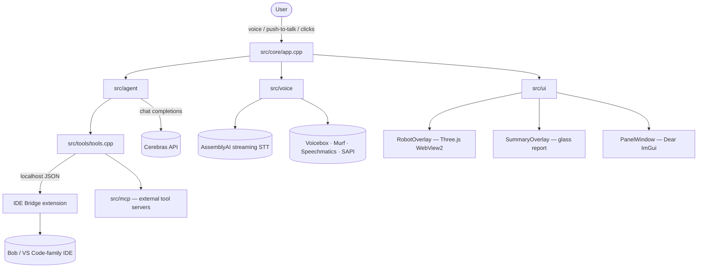

# Argos Desktop — Onboarding



## What this is

A Windows desktop AI companion: a small always-on-top robot (WebView2 + Three.js)
plus an ImGui control panel. It hears you (push-to-talk or double-click), runs an
agent loop against Cerebras, and acts through native tools — file ops, shell
commands, an HTTP bridge that drives a VS Code-family IDE (including IBM Bob),
and MCP servers. Tech: C++20, Win32, WebView2, DirectComposition, Dear ImGui,
WinHTTP, DPAPI for stored secrets. Build with CMake + vcpkg.

## Module tour

| Area | Files | What to know |
|---|---|---|
| App shell | `src/core/app.cpp` | Window-less message loop, owns every subsystem, forwards events |
| Config | `src/core/config.cpp` | JSON at `%APPDATA%\ArgosDesktop\config.json`; secrets sealed with DPAPI |
| Agent | `src/agent/agent.cpp` | System prompt, tool-call loop, sub-agent delegation, history sanitizing |
| Tools | `src/tools/tools.cpp` | All tool schemas + implementations; `resolve()` roots paths in the IDE workspace |
| IDE bridge | `src/bridge/ide_bridge.cpp` | Reads `ide-bridge.json` discovery file, POSTs `/command` to the extension |
| Voice | `src/voice/voice.cpp` | Record → AssemblyAI → utterance queue → TTS engine chain |
| TTS | `src/voice/tts_engines.cpp` | Voicebox, Murf, Speechmatics, SAPI — picked from config |
| Robot | `src/ui/robot_overlay.cpp` + `assets/argos_robot.html` | Click-through DComp window; `set_roam_hold` parks it |
| Summary | `src/ui/summary_overlay.cpp` + `assets/argos_summary.html` | The glass report you're reading now |
| Panel | `src/ui/panel_ui.cpp` | Chat, Transcript, Settings, Tools, Phone, Log tabs |
| MCP | `src/mcp/` | Client for external Model Context Protocol servers |
| IDE ext | `extension-ide/src/` | TypeScript VS Code extension exposing the bridge HTTP API |

## Setup / build / test

```powershell
cmake --build build --config Release     # builds + stages bin\argos.exe + assets
bin\argos.exe                            # run — needs WebView2 runtime
```

No unit-test suite; verification is manual: robot overlay visible, Tools tab
shows a green bridge dot, send "hi" in Chat and watch a tool round-trip.

## Conventions & gotchas

- **Everything resolves through `resolve()`** — relative paths root in the
  connected IDE's workspace, not the exe dir. Don't use raw `current_path()`.
- Secrets never enter `config.json` plaintext — always go through the DPAPI
  helpers in `src/core/config.cpp`.
- The robot and summary overlays are click-through layered windows with
  `WS_EX_NOREDIRECTIONBITMAP` — alpha comes from DirectComposition, not
  `SetLayeredWindowAttributes`.
- Voice utterances are queued, not dropped — call `speak()` in short bursts;
  Esc cancels the queue via `stop_speaking`.
- Bridge calls are synchronous WinHTTP on whatever thread invokes them —
  UI code wraps them in `std::async` (`pending` future pattern in `panel_ui.cpp`).
- New tools: add schema in `schemas_json()`, route in `execute()`, then teach
  the prompt in `agent.cpp`. All three places, every time.

## Who to ask

| Area | Top contributor |
|---|---|
| whole repo | zrald (12 commits) — agent loop, voice pipeline, bridge |
| backend relay | Umaima Mughal, x_drxzx_x |

## Suggested first tasks

1. **Easy:** Read `src/tools/tools.cpp` `execute()` and add a `time_now` tool —
   touches the full tool pipeline in ~20 lines.
2. **Medium:** Add a fifth TTS engine — see `tts_engines.cpp` SAPI impl as the
   template, register in config + Settings UI.
3. **Hard:** Persist onboarding reports — save rendered summary HTML next to
   `ONBOARDING.md` and reopen without regenerating.

## Recent history

- `1ea7a2f` Bitdeer sub-agents + voice pipeline (dblclick → AssemblyAI → Cerebras)
- `1e7d363` restore agent-loop worktree files
- `dd52f05` Cerebras agent loop + chat tab + file_stat fix
- `01e9fd2` native C++ desktop + phone↔desktop relay
